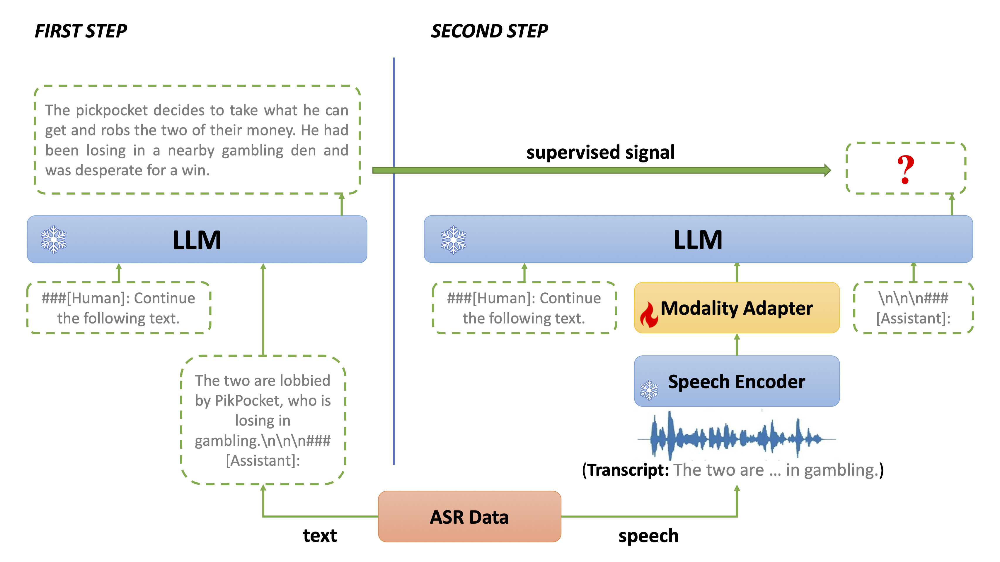
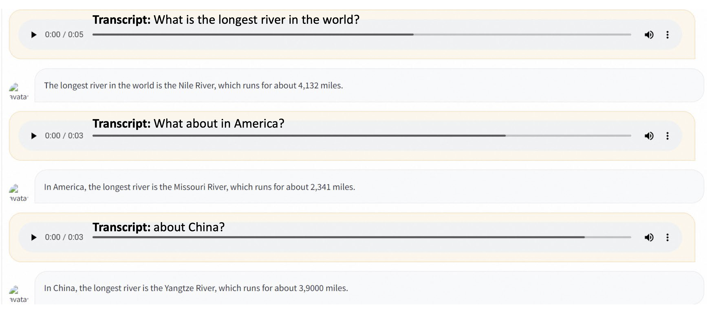
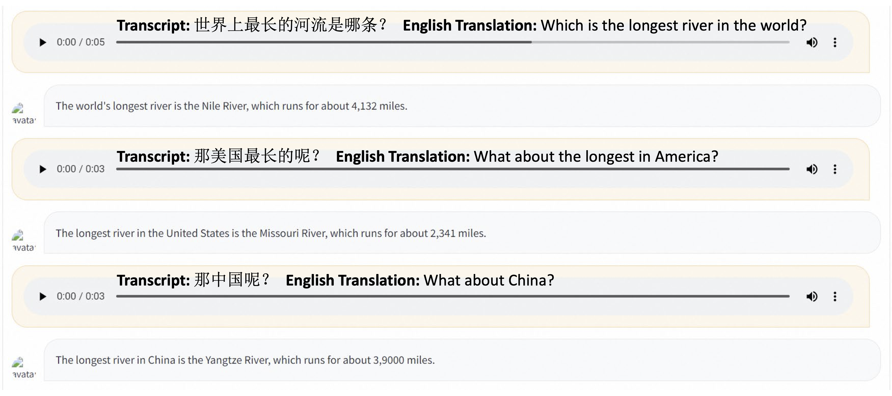

# BLSP: Bootstrapping Language-Speech Pre-training via Behavior Alignment of Continuation Writing

Chen Wang, Minpeng Liao, Zhongqiang Huang, Jinliang Lu, Junhong Wu, Yuchen Liu, Chenqing Zong, Jiajun Zhang

**Institute of Automation, Chinese Academy of Sciences**

**Machine Intelligence Technology Lab, Alibaba DAMO Academy**

<a href='https://cwang621.github.io/blsp.github.io'></a>  <a href='https://arxiv.org'> </a>


This paper has been submitted to arXiv and will be accessible after Wednesday, September 6th.

## Introduction

* BLSP extends the language capabilities of LLMs to speech, enabling iteraction with LLMs through spoken languages. 
* We learn the BLSP model via behavior alignment of continuation writing. Ideally, LLMs should have the same behavior regardless of the modality of input, a speech segment or its transcript.
    * The first step utilizes LLMs to generate text with the transcript as prefix, obtaining the continuations.
    * The second step leverages the text continuations as supervised signals to learn the modality adapter by requiring LLMs to predict the text continuations given the speech segment. 



## Examples






More examples with video presentations can be found in the [project page](https://cwang621.github.io/blsp.github.io).


## Usage

### Enviroment Preparation
All experiments are carried out in the following environment.

* Python==3.8
* torch==1.13, torchaudio==0.13.0, cuda==11.6
* transformers==4.31.0
* soundfile==0.12.1,  openai-whisper
* datasets==2.12.0, accelerate==0.21.0, deepspeed==0.9.3
* evaluate==0.4.0, sentencepiece==0.1.99
* fire==0.5.0, gradio==3.41.2


### Prepare the pretrained BLSP checkpoint

Download the pretrained BLSP model [link](https://www.modelscope.cn/models/damo/blsp_lslm_7b/)


### Inference & Evaluation
We release the inference code for evaluation.

The supported input file is `.jsonl` format. Here is an example of ST task. Each line of input file looks like
```txt
{"audio": "/home/data/eval/1.wav"}
```
Then run the generation code
```bash
python3 blsp/generate.py \
    --input_file "test.jsonl" \
    --output_file "test_out.jsonl" \
    --blsp_model $blsp_path \
    --instruction "Please translate the following audio into German text."
```


### Launching Demo Locally

You can try out our demo by
```bash
export CUDA_VISIBLE_DEVICES=0
python blsp/chat_demo.py \
    --blsp_model $blsp_path
```

## Training from Scratch

The training of BLSP contains two stages.

###  Stage 1: Finetune LLM with text instruction data
1. Download the text instruction data **[Alpaca-52k](https://github.com/tatsu-lab/stanford_alpaca)** to `~/data/alpaca_data.json` and run the process script.
``` bash
mkdir -p ~/data/stage1
python data_process/prepare_alpaca.py \
    --input_file ~/data/alpaca_data.json \
    --output_file ~/data/stage1/train_alpaca.jsonl
```

2. Obtain **[Llama2-7B Model](https://huggingface.co/docs/transformers/main/model_doc/llama2)** to `~/pretrained_models/llama2-7b-hf`. Then run the training script to perform text instruction tuning.
``` bash
export llama_path=~/pretrained_models/llama2-7b-hf
export DATA_ROOT=~/data/stage1
export SAVE_ROOT=~/checkpoints/stage1
bash blsp/scripts/train_stage1_ddp.sh
```
This step takes about 2 hours on 8 A100. 


### Stage 2: Align speech and text via behavior alignment of continuation writing
1. Download the ASR dataset **[GigaSpeech](https://github.com/SpeechColab/GigaSpeech)**, **[LibriSpeech](https://www.openslr.org/12)**, **[Common Voice 2.0](https://commonvoice.mozilla.org/en/datasets)** to `~/data/gigaspeech`, `~/data/librispeech`, `~/data/common_voice` respectively. Then run the process scripts.
``` bash
mkdir -p ~/data/stage2
python data_process/prepare_gigaspeech.py \
    --input_dir ~/data/gigaspeech \
    --output_file ~/data/stage2/train_gigaspeech.jsonl
python data_process/prepare_librispeech.py \
    --input_dir ~/data/librispeech \
    --output_file ~/data/stage2/train_librispeech.jsonl
python data_process/prepare_common_voice.py \
    --input_dir ~/data/common_voice \
    --output_file ~/data/stage2/train_common_voice.jsonl
```

2. Use the stage1 model to continue the transcription of ASR data. Here we take GigaSpeech dataset as example.
```bash
mkdir -p ~/data/stage2/labels

export CUDA_VISIBLE_DEVICES=0
python3 -u data_process/asr_text_generation.py continue_writing \
    --llm_path ~/checkpoints/stage1 \
    --manifest ~/data/stage2/train_gigaspeech.jsonl \
    --lab_dir ~/data/stage2/labels \
    --nshard 8 \
    --rank 0 &
.
.
.
export CUDA_VISIBLE_DEVICES=7
python3 -u data_process/asr_text_generation.py continue_writing \
    --llm_path ~/checkpoints/stage1 \
    --manifest ~/data/stage2/train_gigaspeech.jsonl \
    --lab_dir ~/data/stage2/labels \
    --nshard 8 \
    --rank 7 &
```

3. (Optional) We recommend that you process the data offline and save to disk. The preprocessing process will filter out speech-text pairs that cannot be loaded by soundfile.
```bash
python blsp/src/speech_text_paired_dataset.py offline \
    --dataroot ~/data/stage2/labels \
    --manifest_files *.jsonl \
    --lm_path ~/checkpoints/stage1 \
    --instruction "Continue the following text in a coherent and engaging style with less than 40 words." \
    --num_proc 32
```

4. Download **[whisper-small](https://huggingface.co/openai/whisper-small)** to `~/pretrained_models/whisper-small` and then run the training script.
```bash
export llama_path=~/checkpoints/stage1
export whisper_path=~/pretrained_models/whisper-small
export DATA_ROOT=~/data/stage2/labels
export SAVE_ROOT=~/checkpoints/stage2
bash blsp/scripts/train_stage2_ddp.sh
```

The training process takes about 2.5 days on 8 A100. 


## License
* The license of our project is [Apache License 2.0]()
* Our models are based on Llama2 and Whisper. If you want to use our models, please do not violate the [MIT License](https://github.com/openai/whisper/blob/main/LICENSE) of whisper and the [License](https://github.com/facebookresearch/llama/blob/main/LICENSE) of LLaMA-2
